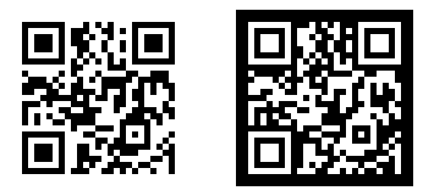

# qr-atomize

Atomize any QR code image to its **absolute minimum filesize** — 1 pixel per module.

Takes an oversized QR code (PNG, JPEG, GIF, WebP, BMP, TIFF, ICO), decodes it, and re-renders it at native resolution where each symbol module is exactly 1 pixel. Output is a **1-bit PNG** (or optionally GIF).

QR codes with embedded logos are fully supported — the logo overlay is discarded during atomization (error correction handles the missing modules).

[](test/fixtures/)

## Install

```bash
npm install qr-atomize          # as a dependency
npm install -g qr-atomize       # globally for CLI use
```

## CLI

```bash
# npx (no install needed)
npx qr-atomize input.png

# global install
qr-atomize input.png
qr-atomize input.jpg -o tiny.png
qr-atomize input.gif --border 0 --format gif
qr-atomize input.bmp
```

```
qr-atomize <input> [options]

Options:
  -o, --output <file>   Output path (default: <input>-atomized.png)
  -b, --border <n>      Quiet zone in modules (default: 2)
  -f, --format <fmt>    Output format: png (default) or gif
  -h, --help            Show help
```

## Library

```js
// ESM
import atomizeQr from 'qr-atomize';
const png = await atomizeQr(readFileSync('qrcode.png'));

// CommonJS
const atomizeQr = require('qr-atomize').default;
const png = await atomizeQr(readFileSync('qrcode.png'));
```

### API

```ts
atomizeQr(input: Buffer | string, opts?: {
  border?: number;       // quiet zone in modules (default: 2)
  format?: 'png' | 'gif' // output format (default: 'png')
}): Promise<Buffer>
```

- **input** — image buffer or file path (PNG, JPEG, GIF, WebP, BMP, TIFF, ICO)
- **returns** — `Promise<Buffer>` containing the atomized image

> **Note:** `atomizeQr` is async (returns a Promise) because image decoding uses async operations internally.

### Sub-module exports

```js
import { decodeInput, reEncode } from 'qr-atomize';

// decodeInput(buf) → Promise<{ width, height, data }> (raw RGBA pixels)
// reEncode(text, opts?) → Uint8Array (encoded QR image)
```

## How it works

1. **Decode** the input image to raw RGBA pixels (via `cross-image`)
2. **Parse** the QR code using finder-pattern detection and error correction
3. **Re-encode** the decoded payload at `scale: 1` (1 pixel per module) as a 1-bit PNG

This is **not** a resizer — it's a decode-and-remint operation. The output is guaranteed pixel-perfect.

## Supported input formats

| Format | Extension |
|--------|-----------|
| PNG    | `.png`    |
| JPEG   | `.jpg`, `.jpeg` |
| GIF    | `.gif`    |
| WebP   | `.webp`   |
| BMP    | `.bmp`    |
| TIFF   | `.tiff`, `.tif` |
| ICO    | `.ico`    |

## License

MIT
